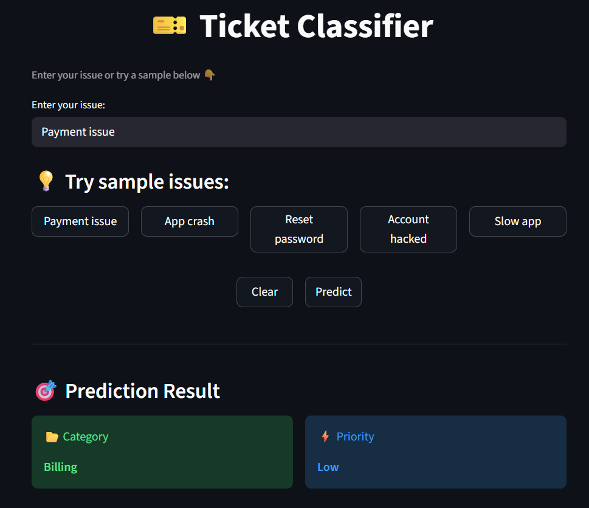

# 🧠 NLP Ticket Classifier

## 📌 Problem Statement

Customer support systems receive a large number of queries daily. Manually categorizing these tickets into appropriate departments (Billing, Technical, Security, etc.) is time-consuming and inefficient.

The goal of this project is to build an automated NLP-based system that can classify support tickets into predefined categories and assign priority levels.

---

## 🚀 Features

- Classifies support tickets into:
  - Billing
  - Technical
  - Login Issue
  - Security
  - Delivery
  - Query
- Priority prediction (High / Medium / Low)
- FastAPI backend for real-time predictions
- Streamlit frontend for interactive UI
- End-to-end ML pipeline implementation

---
## 🎯 Demo


## 🚀 Live Application

The project is deployed and accessible here:  
🔗 (https://nlp-ticket-classifier.streamlit.app/)

---

## 🛠️ Tech Stack

- Python  
- Scikit-learn  
- TF-IDF Vectorization  
- Logistic Regression  
- FastAPI  
- Streamlit  

---

## 📁 Files Included

- `app.py` → FastAPI backend  
- `ui.py` → Streamlit frontend  
- `model.pkl` → Trained ML model  
- `tfidf.pkl` → TF-IDF vectorizer  
- `model_training.ipynb` → Model training notebook  
- `requirements.txt` → Dependencies
- `demo.png` → Screenshot of working application

---

## ⚙️ How to Run

### 1️⃣ Install dependencies
```bash
pip install -r requirements.txt
```
---
## 🧠 Key Learnings

- Understood how text data is converted into numerical features using TF-IDF
- Learned how machine learning models handle text classification problems
- Gained experience in building an end-to-end ML pipeline (data → model → API → UI)
- Understood the importance of data quality and balanced datasets
- Learned how keyword patterns affect model predictions
- Integrated backend (FastAPI) with frontend (Streamlit)
- Learned how to deploy and structure ML projects professionally
---
## ⚠️ Challenges Faced

- Small dataset caused inaccurate predictions initially  
- Model was biased towards certain categories (like Billing)  
- Similar categories (e.g., Technical vs Query) were confusing for the model  
- Difficulty in improving model accuracy with limited data  
- Managing consistency between training and prediction preprocessing  
- Integrating FastAPI backend with Streamlit frontend
---
## 🚀 Future Improvements

- Improve model accuracy using a larger and more diverse dataset  
- Try advanced models such as Random Forest or transformer-based models (BERT)  
- Add proper evaluation metrics (accuracy, precision, recall, confusion matrix)  
- Replace rule-based priority system with a machine learning-based approach  
- Deploy the full system (FastAPI + Streamlit) on cloud platforms  
- Improve UI/UX for better user experience  
---
## 👨‍💻 Author
**Shashwat Singh**  
B.Tech (3rd Year) | Data Analyst | Machine Learning  

---

## 🔗 Connect with Me
- LinkedIn: *((https://www.linkedin.com/in/shashwat-singh-aa83022a1/))*
- Email: shashwat3210dl@gmail.com 
